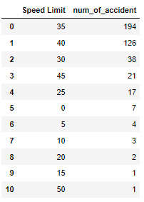

# Columbia_Engineering_Data_Analytics_Project_1

# PROJECT I

###### - Team Members: Karen Lin, Kevin Zhang, Sunjae Youm   - Date: 6/17/2024   - Data Source: https://catalog.data.gov/dataset/crash-reporting-drivers-data/resource/9851a37f-4f32-464e-8ba6-c23023653a7f

### **Abstract**

Our data team assumed that we received a data request from the Montgomery County local government in Maryland. The purpose of the request was to determine how to use the county budget to reduce car accidents. Additionally, Montgomery County wanted to choose a specific municipality and asked us, as data analysts, to identify which roads need immediate improvements. To achieve this, we investigated traffic accident records from January 2015 to March 2024, analyzing the main car crash accident factors and variables from the dataset.

### **Data Processing**

<ol>
<li>Loaded all dependencies/libraries for the data processing</li>
<li>Filtered out the rows have no values and have values "N/A" in the "Municipality" column </li>
<li>Review the dataset by creating the pivot tables in excel and extract only require columns </li>

<li>break out the column "Crash Date/Time" to "Date", "Time", "Year", "Month", "Day" for detail analysis - Used CHATGPT </li>

</ol>

### **Chart and Visualization**
<ol>
<li>created a pie chart to narrow down which municipality has the most car accidents</li>
<li>narrowed down to "ROCKVILLE" Manucipality and looking at the # of car accidents between 2021 and 2023</li>
<li>Draw a map plot to visually show which road has the most accidents </li>
<li>In order to clarify the road, grouped the data by "Road Name" and plot the horizontal bar graph</li>
<li>focused on the Road Name Rockville Pike and start lookin at the number of accidents by three angles "Speed Limit", "Traffic Control", "Surface Condition"</li>
<li>Broke down the number of car accidents by hourly intervals and create the frequency table and histogram - Used CHATGPT to create the hourly intervals</li>
<li>group by Year-month to see the trend of car accidents in three years (2021-2023)</li>
</ol>

### **Analysis**
<ol type="I">
<li>"grouped_df1" and the pie chart representing the top 5 municipalities showing the number of car accidents, the 'ROCKVILLE' municipality has the highest number of car accidents. 

 

<li>From the f1_grouped_df1 and the horizontal bar chart representing the top 10 Roads, the 'ROCKVILLE PIKE' Road has the highest number of car accidents.  

 

<li>
Draw a map plot to visually show which road has the most accidents

 

</li> 
<li>filtering the dataset by Road Name 'ROCKVILLE PIKE'
<ol type="i"> 

<li>
The number of car accidents in Rockville Pike in perspective of <b>Speed Limits.</b> 80% of the number of accidents were occured between 35 and 45 limit.
 

 

</li>

<li>
The number of car accidents in Rockville Pike in perspective of <b>Traffic Control</b>. Car accident near Traffic Signal was the number one reason among other traffic controls
 

 

</li>

<li>
The number of car accidents in Rockville Pike in perspective of <b>Surface Condition & Weather</b>.  There was any significant relationship between surface condition and number of car accidents
 

 
 
 

</li>

<li>
The number of car accidents by Hourly Intervals 
The number of car accidents were higher than other hour interval at between "12:00 PM and 1:00PM", "02:00PM and "06:00PM" and "07:00 PM and 08:00PM".
 

 

<li>number of car accidents by Year-Month There is a pattern observed that car accidents increase in June every year. Research shows that the traffic congestion is getting higher due to the increase of population (https://empowermontgomery.com/transit-power/)

 

</ol>

</ol>

### **Recommendation**
<ol>
<li> For car accidents that occur on roads with speed limit 35 and 40 mph, One suggestion is to reduce the speed limit, but further study needs to be done to see which roads the accidents occurred, to tailor the response and take into account congestion times.</li>
<li>The road has higher speed limit and normally drivers get into the car accident when they try to pass the yellow light. With that said, shorting the yellow light time would help improve the number of car accident/li>
<li>Place more traffic polices on the ROCKVILLE PIKE on the time intervals have the most car accidents</li>
<li>Expand the highway right next to Rockville Pike or put more traffic police in June to control the traffic</li>
</ol>

### **Conclusion**
<ul>
<li>With the two data perspectives Speed Limit and Traffic Signal, we could narrow down to the final recommendation</li>
<li>Based upon the filters (speed limit & traffic signal), 155 records could be collected</li>
<li>Final Recommendation for this analysis is lower the speed limit on the spotted area in the map or control traffic signal light</li>
</ul>

